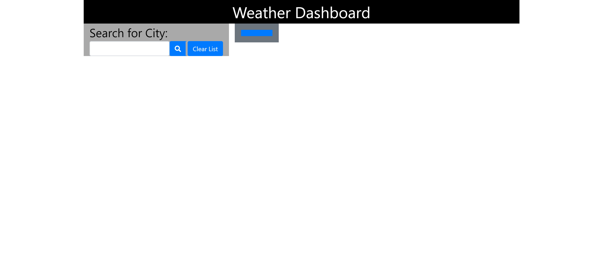

# weather_forecast

Just key in the city name & the weather for that day & that city will pop up. In the bottom in the blue area is the 5 day forecast for that city. Any city entered will also have a new button created. This screen will also "remember" what you put in for the next time you use the app.

### Instrutions:

-   Add city name in "Search for City" & hit go button or enter
-   The weather for that city will diplay.
    

### Prerequisites

Needed an API key for openweathermap.org.

### Installing

Installed using GitHub with following commands:

-   git add -A
-   git commit -m"comment goes here"
-   git push

## Running the tests

No automated testing

## Built With

-   HTML
-   Bootstrap
-   AJAX
-   JavaScript

## Authors

-   **Jim Denis** - _Initial work_ - [JimDenis](https://github.com/JimDenis)

This app can be found on https://jimdenis.github.io/weather_forecast/.
